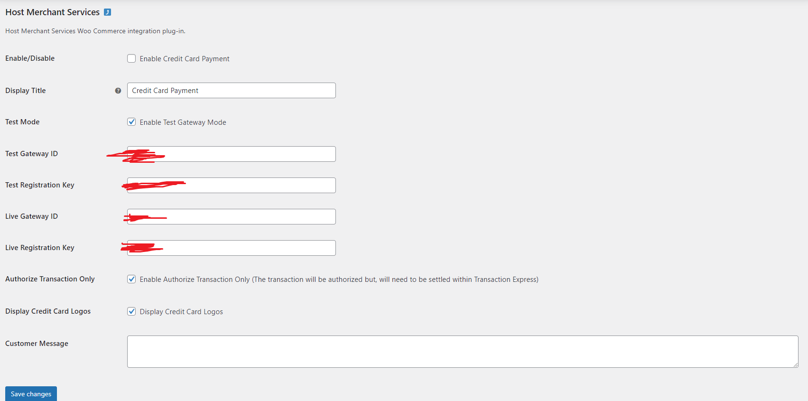

# Integration module for Wordpress WooCommerce
##### Version 1.0
 
## Requirements
1. Wordpress (Tested on v6.0.2)
2. WooCommerce installed (Tested on v7.0.0)

## Installation
1. Download "woocommerce-hms-payment-gateway.zip" ZIP File
2. In the WP-Admin open "Plugins" - "Add New"
3. Press "Upload Plugin" on the header
4. Upload "woocommerce-hms-payment-gateway.zip" ZIP file to Wordpress

## Epoint adaptation
1. After installation open "WooCommerce" - "Settings" - "Payments"
2. Open "HMS Payments"
3. Put your Payment Key in the text fields

   
   
5. Enable Gateway
6. Save Changes
7. Enjoy

## Contributing
Pull requests are welcome. For major changes, please open an issue first to discuss what you would like to change.
Please make sure to update tests as appropriate.
